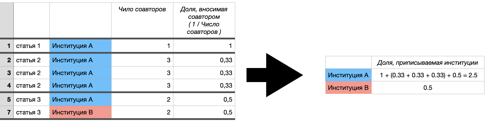

```{r setup, include=FALSE}
knitr::opts_chunk$set(echo = FALSE,  warning = FALSE, message =  FALSE) # By default, hide code; set to TRUE to see code
#knitr::opts_chunk$set(fig.pos = 'p') # Places figures on pages separate from text
#knitr::opts_chunk$set(out.width = '100%', dpi=300) # Figure resolution and size
#knitr::opts_chunk$set(fig.env="figure") # Latex figure environment
```

```{r packages}
library(tidyverse)
library(haven)
library(readr)
library(table1)
library(sjlabelled)
library(ggpubr)
library(ggridges)
library(ggsignif)
library(patchwork)
library(expss)
library(FactoMineR)
library(factoextra)
library(RColorBrewer)
library(stringr)
library(stringr)
library(stringi)
library(tidyverse)
library(haven)
library(readr)
library(table1)
library(sjlabelled)
library(ggpubr)
library(ggridges)
library(ggsignif)
library(patchwork)
library(tibble)
library(ggpmisc)
library(readxl)
#library(glmmTMB)
#library(sjPlot)
#library(sjmisc)
library(sjlabelled)
#library(jtools)
#library(ggstance)
#library(huxtable)
#library(MASS)
#library(pscl) 
library(data.table)
library(ggthemes)
library(ggpubr)
library(knitr)
options(kableExtra.latex.load_packages = FALSE)
library(kableExtra)
library(DT)
## скользящее среднее
library(tidyquant)
library(plotly)
```

```{r functions}
pvalue <- function(x, ...) {
    # Construct vectors of data y, and groups (strata) g
    y <- unlist(x)
    g <- factor(rep(1:length(x), times=sapply(x, length)))
    if (is.numeric(y)) {
        # For numeric variables, perform a standard 2-sample t-test
        p <- t.test(y ~ g)$p.value
    } else {
        # For categorical variables, perform a chi-squared test of independence
        p <- chisq.test(table(y, g),correct = TRUE, simulate.p.value = TRUE, B = 10000)$p.value
    }
    # Format the p-value, using an HTML entity for the less-than sign.
    # The initial empty string places the output on the line below the variable label.
    c("", sub("<", "&lt;", format.pval(p, digits=3, eps=0.001)))
}


#simulate.p.value = FALSE, B = 2000

all_test <- function(x, ...) {
    # Construct vectors of data y, and groups (strata) g
    y <- unlist(x)
    g <- factor(rep(1:length(x), times=sapply(x, length)))
    if (is.numeric(y)) {
        # For numeric variables, perform a standard 2-sample t-test
        p <- t.test(y ~ g)$p.value
        t <- t.test(y ~ g)$statistic
        par <- t.test(y ~ g)$parameter
    } else {
        # For categorical variables, perform a chi-squared test of independence
        p <- chisq.test(table(y, g))$p.value
        t <- chisq.test(table(y, g))$statistic
        par <- chisq.test(table(y, g))$parameter
    }
    # Format the p-value, using an HTML entity for the less-than sign.
    # The initial empty string places the output on the line below the variable label.
    c("", paste0(sub("<", "&lt;", format.pval(p, digits=3, eps=0.001)), "; val test stat = " , round(t, digits=3), "; df =" , round(par, digits=3)))
}
```

```{r data}
data <- read_excel("data/full_data_precise original.xlsx") 

#data2 <- read_excel("data/data_website original.xlsx")


#organisation_full_names <- read_excel("data/organisation_full_names.xlsx") %>% select(1,2) %>%
# rename(organisation_full_from_exel = organisation_full)

#colnames(data)
```

```{r data_mod}
data <- data %>% 
  mutate(year_group = case_when(year >= 1990 & year <= 2000 ~ "1990-2000",
                                year >= 2001 & year <= 2010 ~ "2001-2010",
                                year >= 2011 & year <= 2020 ~ "2011-2020",
                                TRUE ~ as.character(year))) %>% 
  mutate(year_group = factor(year_group, levels = c("1990-2000", "2001-2010","2011-2020"))) 
```

------------------------------------------------------------------------

## ВАЖНЫЕ ЗАМЕЧАНИЯ

> В документе всё построено на `full_data_precise_original`. Никаких
> манипуляций с данным не произведено. Если исследовательская область
> выглядит как список, например, `Political Science; Area Studies`,
> тогда публикация дублируется и считается как +1 публикация для каждой
> из областей в списке. Фракционализация проводилась только для
> институтский в разделе I, пункте (8) (показаны таблицы и с
> фракционализацией и без).

> в файле `full_data_precise_original` странная переменная collab_type
> (solo не значит, что автор один)

------------------------------------------------------------------------

## I. PRODUCTION OF PUBLICATIONS

#### (1) График динамики, на котором также виден прирост в % (вторая шкала). Типа такого. Два графика: один для социальных наук, один для гуманитарных.

На рис 1А видно, что публикации в ['SSCI'] на протяжение 1990-2007 годов
варьировались в диапазоне до \~400 публикаций в год. После 2008 года
рубеж в 400 публикаций стабильно преодален и количество публикаций в год
нарастало вплоть до \~600 в 2020. Похожая тенденция у ['SSCI', 'AHCI'].

На рис 1Б хаотичные тенденции. Можно конечно разглядеть, что в ['SSCI']
в 2008 году произошел всплеск публикаций по сравнению с 2007 и
предположить, что это вторжение в Грузию, но тогда нужно как-то пытаться
интерпретировать почему в 2007 случился провал в ['SSCI', 'AHCI'] и
['AHCI'] по сравнению с 2006.

```{r, eval=FALSE}
data %>% distinct(UT, .keep_all = TRUE) %>% 
  ggplot(aes(year)) +
  geom_bar(stat = "count") +
  facet_wrap(~field)

```

```{r, eval=FALSE}
data %>% distinct(UT, .keep_all = TRUE) %>% select(year,field) %>% 
  #filter(field == "['SSCI']") %>% 
  group_by(year, field) %>% count() %>% ungroup() %>% 
  group_by(field) %>% arrange(field, year) %>% 
  #mutate(change_to_1990 = 100 * n / n[year==1990]) %>% 
  mutate(grow = (n *100 /lag(n)) - 100) %>%  
  ggplot(aes(as.factor(year), grow, group = field)) +
  geom_hline(yintercept = 0, linetype = "dashed") +
  geom_point() + 
  geom_line()+
  theme_bw() + 
  facet_wrap(~field, nrow = 3) +
  scale_y_continuous(labels = function(x) paste0(x, "%")) +
  #labs(y = "Change to 2016", subtitle = "2016 as 100%", title = "Change in PhDs count over 10 years") +
  theme(legend.position = "none",
        legend.justification ='left') + 
  theme(axis.title.x = element_blank(),
        panel.grid = element_blank()) +
  theme(strip.background = element_rect(fill = NA))+
  theme(strip.text = element_text(colour = 'black')) +
  theme(strip.text = element_text(size = 7)) +
  theme(axis.text.x = element_text(size = 6, angle = 90)) +
  theme(axis.text.y = element_text(size = 8)) +
  theme(legend.title= element_blank()) 

```

```{r}
df <- data %>% distinct(UT, .keep_all = TRUE) %>% select(year,field) %>% 
  #filter(field == "['SSCI']") %>% 
  group_by(year, field) %>% count() %>% ungroup() %>% 
  group_by(field) %>% arrange(field, year) %>% 
  mutate(change_to_1990 = 100 * n / n[year==1990]) # %>% 
  #mutate(grow = (n *100 /lag(n)) - 100)
#df$grow[df$year == 1990] <- 0

ylim.prim <- c(0,600)   # in this example, precipitation
ylim.sec <- c(60, 200)    # in this example, temperature

b <- diff(ylim.prim)/diff(ylim.sec)
a <- ylim.prim[1] - (b*ylim.sec[1]) # there was a bug here

ggplot(df,aes(x=year)) + 
  geom_col(aes(y = n), fill = "grey") +
  geom_hline(yintercept = a + 100*b, linetype = "dashed",  color = "blue") +

  #geom_line(aes(y = a + grow*b), size = 1, color = "blue") +
  ggalt::geom_xspline(aes(y = a + change_to_1990*b), size = 1, color = "blue",spline_shape=-0.4) +
  geom_point(aes(y = a + change_to_1990*b), colour="black",pch=21, size=2) +
  scale_y_continuous(sec.axis = sec_axis(~ (. - a)/b, name = "Change to 1990",
                     labels = function(b) { paste0(b, "%")})) + 
  
  scale_x_continuous(
        labels = as.character(seq(min(df$year), max(df$year), by = 1)), 
        breaks = seq(min(df$year), max(df$year), by = 1), 
        expand=c(0,0)
    ) +
   facet_wrap(~field, nrow = 3) +
    theme_bw() +
  theme(axis.title.y = element_text(color = "grey")) +
  theme(axis.line.y.right = element_line(color = "blue"), 
        axis.ticks.y.right = element_line(color = "blue"),
        #axis.text.y.right = element_text(color = "blue"), 
        axis.title.y.right = element_text(color = "blue", vjust=3)) + 
  labs(y = "Number of papers", subtitle = "1990 за 100%", title = "(А) Число статей + настоколь это число росло/падало по сравнению с 1990") +
  theme(legend.position = "none",
        legend.justification ='left') + 
  theme(axis.title.x = element_blank(),
        panel.grid = element_blank()) +
  theme(strip.background = element_rect(fill = NA))+
  theme(strip.text = element_text(colour = 'black')) +
  theme(strip.text = element_text(size = 7)) +
  theme(axis.text.x = element_text(size = 6, angle = 90, vjust=0.5)) +
  theme(axis.text.y = element_text(size = 8)) +
  theme(legend.title= element_blank())

df <- data %>% distinct(UT, .keep_all = TRUE) %>% select(year,field) %>% 
  #filter(field == "['SSCI']") %>% 
  group_by(year, field) %>% count() %>% ungroup() %>% 
  group_by(field) %>% arrange(field, year) %>% 
  #mutate(change_to_1990 = 100 * n / n[year==1990]) # %>% 
  mutate(grow = (n *100 /lag(n)) - 100)
df$grow[df$year == 1990] <- 0

ylim.prim <- c(0,600)   # in this example, precipitation
ylim.sec <- c(-30, 45)    # in this example, temperature

b <- diff(ylim.prim)/diff(ylim.sec)
a <- ylim.prim[1] - (b*ylim.sec[1]) # there was a bug here

ggplot(df,aes(x=year)) + 
  geom_col(aes(y = n), fill = "grey") +
  geom_hline(yintercept = a + 0*b, linetype = "dashed",  color = "blue") +

  #geom_line(aes(y = a + grow*b), size = 1, color = "blue") +
  ggalt::geom_xspline(aes(y = a + grow*b), size = 1, color = "blue",spline_shape=-0.6) +
  geom_point(aes(y = a + grow*b), colour="black",pch=21, size=2) +
  scale_y_continuous(sec.axis = sec_axis(~ (. - a)/b, name = "Growth rate",
                     labels = function(b) { paste0(b, "%")})) + 
  
  scale_x_continuous(
        labels = as.character(seq(min(df$year), max(df$year), by = 1)), 
        breaks = seq(min(df$year), max(df$year), by = 1), 
        expand=c(0,0)
    ) +
   facet_wrap(~field, nrow = 3) +
    theme_bw() +
  theme(axis.title.y = element_text(color = "grey")) +
  theme(axis.line.y.right = element_line(color = "blue"), 
        axis.ticks.y.right = element_line(color = "blue"),
        #axis.text.y.right = element_text(color = "blue"), 
        axis.title.y.right = element_text(color = "blue", vjust=3)) + 
  labs(y = "Number of papers", subtitle = "для года n точкой отсчета будет являться n-1 год, а не 1990 как на графике (А)", title = "(Б) Число статей + их прирост от года к году") +
  theme(legend.position = "none",
        legend.justification ='left') + 
  theme(axis.title.x = element_blank(),
        panel.grid = element_blank()) +
  theme(strip.background = element_rect(fill = NA))+
  theme(strip.text = element_text(colour = 'black')) +
  theme(strip.text = element_text(size = 7)) +
  theme(axis.text.x = element_text(size = 6, angle = 90, vjust=0.5)) +
  theme(axis.text.y = element_text(size = 8)) +
  theme(legend.title= element_blank())

```

#### (2) График динамики по областям. Отдельно график, на котором тренд увеличивающийся. Отдельно, на котором уменьшающийся тренд. Отдельно в долях от всех публикаций за год и отдельно в статьях.

##### (2a) Все вместе (без разбивки по fields)

Из рисунка 2А хорошо видно структуру Рашн стадис. Видно, что по политологии, экономики, истории и литературе написан основной массив всех текстов за 1990-2020. Но динамика считывается тут плохо, посмотрим на 2Б, из которого видно, что История сильно приросла в процентах от всех областей. Так же доля социологии, лингвистики и философии приросли. Доли Арт и литературы снизились. Очень стабильную долю на за 1990-2020 держит только политология (в районе 20%). На самом деле еще экономика, кроме всплеска доли в конце 90-х (может интерес вызван исследованиям кризиса 1998) 

```{r, fig.dim = c(8.8, 5)}
data %>% distinct(UT, .keep_all = TRUE) %>% select(year,research_areas,field) %>% 
  
  ## разворачиваем research_areas
  separate_rows(research_areas, sep=";") %>% 
  mutate(research_areas = str_trim(research_areas, "both")) %>% 
  
  group_by(research_areas) %>% mutate(research_areas = case_when(n() < 600 ~ "OTHER AREAS",
                                                                 TRUE ~ research_areas)) %>% ungroup() %>% 
  group_by(year, research_areas) %>% count() %>% ungroup() %>% 
  group_by(year) %>% 
  mutate(perc = n / sum(n)) %>% 

  ggplot(aes(x=year, y=perc, fill=research_areas)) + 
    geom_area(alpha=0.8 , size=0.5, colour="black") +
    scale_x_continuous(
        labels = as.character(seq(min(df$year), max(df$year), by = 1)), 
        breaks = seq(min(df$year), max(df$year), by = 1), 
        expand=c(0,0)
    ) +
    scale_y_continuous(labels=scales::percent) +
  labs(title = "A. Все области сразу, без разделения на ['SSCI'], ['AHCI'] и ['SSCI', 'AHCI']") +
  theme_bw() +
  scale_fill_brewer(palette = "Paired") +
  theme(legend.position = "right",
        legend.justification ='left') + 
  theme(panel.grid = element_blank(),
        panel.grid.major.y = element_line(size=0.1, color = "grey70", linetype = "solid")) +
  theme(strip.background = element_rect(fill = NA),
        strip.text = element_text(colour = 'black',size = 7)) +
  theme(axis.title = element_blank(),
        legend.title= element_blank()) +
  theme(axis.text.x = element_text(size = 6, angle = 90, vjust=0.5),
        axis.text.y = element_text(size = 8)) 
```

```{r}
data %>% 
  distinct(UT, .keep_all = TRUE) %>% select(year,research_areas) %>% 
  
  ## разворачиваем research_areas
  separate_rows(research_areas, sep=";") %>% 
  mutate(research_areas = str_trim(research_areas, "both")) %>% 
  
  group_by(research_areas) %>% mutate(research_areas = case_when(n() < 600 ~ "OTHER AREAS",
                                                                 TRUE ~ research_areas)) %>% ungroup() %>% 
  group_by(year, research_areas) %>% count() %>% ungroup() %>% 
  group_by(year) %>% 
  mutate(perc = 100 * n / sum(n)) %>%  
  ggplot(aes(x=year, perc, color=research_areas, group = research_areas)) + 
  geom_line(alpha = 0.3) +
  geom_point(alpha = 0.2, size=1) +
  geom_ma(ma_fun = SMA, n = 3, linetype = "solid") +
  # scale_x_continuous(
  #       labels = as.character(seq(min(df$year), max(df$year), by = 1)),
  #       breaks = seq(min(df$year), max(df$year), by = 1),
  #       expand=c(0,0)
  #   ) +
  scale_y_continuous(labels = function(x) paste0(x, "%")) +
  facet_wrap(~research_areas, nrow = 3) +
  labs(title = "Б. Тоже самое что и рис А, но другой тип визуализации",
      subtitle = "светалая линия - реальные значения; темная линия - скользящее среднее (шаг = 3 года)") +
  theme_bw() +
  scale_color_brewer(palette = "Paired") +
  guides(color=guide_legend(override.aes = list(size=5))) + 
  theme(panel.grid = element_blank(),
        panel.grid.major.x = element_line(size=0.1, color = "grey70", linetype = "solid"),
        panel.grid.major.y = element_line(size=0.1, color = "grey70", linetype = "solid")) +
  theme(strip.background = element_rect(fill = NA),
        strip.text = element_text(colour = 'black',size = 8)) +
  theme(axis.title = element_blank(),
        legend.position = "none",
        legend.title= element_blank()) +
  theme(axis.text.x = element_text(size = 7, angle = 90, vjust=0.5),
        axis.text.y = element_text(size = 8)) 
```


##### (2b) Разбивка по fields

Динамика перерисована дальше в (2с), нагляднее. Столбики с числом статей с раскраской по областям малоинформативны в сцепке с графиком долей, лучше убрать раскраску и оставлять серыми.

```{r, fig.dim = c(8.8, 8)}
df <- data %>% distinct(UT, .keep_all = TRUE) %>% select(year,research_areas,field) %>% 
  
  ## разворачиваем research_areas
  separate_rows(research_areas, sep=";") %>% 
  mutate(research_areas = str_trim(research_areas, "both")) %>% 
  
  filter(field == "['SSCI']") %>% 
  
  group_by(research_areas) %>% mutate(research_areas = case_when(n() < 500 ~ "Other",
                                                                 TRUE ~ research_areas)) %>% ungroup() %>% 

  group_by(year, research_areas) %>% count() %>% ungroup() %>% 
  group_by(year) %>% 
  mutate(perc = n / sum(n))

df2 <- data %>% distinct(UT, .keep_all = TRUE) %>% select(year,research_areas,field) %>% 
  
  ## разворачиваем research_areas
  separate_rows(research_areas, sep=";") %>% 
  mutate(research_areas = str_trim(research_areas, "both")) %>% 
  
  filter(field == "['AHCI']") %>% 
  
  group_by(research_areas) %>% mutate(research_areas = case_when(n() < 500 ~ "Other",
                                                                 TRUE ~ research_areas)) %>% ungroup() %>% 
  group_by(year, research_areas) %>% count() %>% ungroup() %>% 
  group_by(year) %>% 
  mutate(perc = n / sum(n))


df3 <- data %>% distinct(UT, .keep_all = TRUE) %>% select(year,research_areas,field) %>% 
  
  ## разворачиваем research_areas
  separate_rows(research_areas, sep=";") %>% 
  mutate(research_areas = str_trim(research_areas, "both")) %>% 
  
  filter(field == "['SSCI', 'AHCI']") %>% 
  
  group_by(research_areas) %>% mutate(research_areas = case_when(n() < 150 ~ "Other",
                                                                 TRUE ~ research_areas)) %>% ungroup() %>% 
  group_by(year, research_areas) %>% count() %>% ungroup() %>% 
  group_by(year) %>% 
  mutate(perc = n / sum(n))

p1a <- ggplot(df, aes(x=year, y=perc, fill=research_areas)) + 
  geom_col(size=0.3, colour="white") +
    scale_y_continuous(labels=scales::percent) +
          labs(fill = "['SSCI']")+
    theme_bw() +
  scale_fill_brewer(palette = "Paired") +
  theme(panel.grid = element_blank(),
        panel.grid.major.y = element_line(size=0.1, color = "grey70", linetype = "solid")) +
  theme(strip.background = element_rect(fill = NA),
        strip.text = element_text(colour = 'black',size = 7)) +
  theme(axis.title = element_blank()) +
  theme(axis.text.x = element_text(size = 6, angle = 0, vjust=0.5),
        axis.text.y = element_text(size = 8)) 

p1b <- ggplot(df, aes(x=year, y=n, fill=research_areas)) + 
  geom_col(size=0.3, colour="white") +
  theme_bw() +
  scale_fill_brewer(palette = "Paired") +
  labs(title = "['SSCI'] areas",
       subtitle = "Кол-во статей и доля") +
  theme(panel.grid = element_blank(),
        panel.grid.major.y = element_line(size=0.1, color = "grey70", linetype = "solid")) +
  theme(strip.background = element_rect(fill = NA),
        strip.text = element_text(colour = 'black',size = 7)) +
  theme(axis.title = element_blank(),
        legend.position = "none") +
  theme(axis.text.x = element_text(size = 6, angle = 0, vjust=0.5),
        axis.text.y = element_text(size = 8)) 

p1 <- (p1b + p1a) 


p2a <- ggplot(df2, aes(x=year, y=perc, fill=research_areas)) + 
  geom_col(size=0.3, colour="white") +
    scale_y_continuous(labels=scales::percent) +
        labs(fill = "['AHCI']")+
    theme_bw() +
  scale_fill_brewer(palette = "Paired") +
  theme(panel.grid = element_blank(),
        panel.grid.major.y = element_line(size=0.1, color = "grey70", linetype = "solid")) +
  theme(strip.background = element_rect(fill = NA),
        strip.text = element_text(colour = 'black',size = 7)) +
  theme(axis.title = element_blank()) +
  theme(axis.text.x = element_text(size = 6, angle = 0, vjust=0.5),
        axis.text.y = element_text(size = 8)) 

p2b <- ggplot(df2, aes(x=year, y=n, fill=research_areas)) + 
  geom_col(size=0.3, colour="white") +
  theme_bw() +
  scale_fill_brewer(palette = "Paired") +
    labs(title = "['AHCI'] areas",
       subtitle = "Кол-во статей и доля") +
  theme(panel.grid = element_blank(),
        panel.grid.major.y = element_line(size=0.1, color = "grey70", linetype = "solid")) +
  theme(strip.background = element_rect(fill = NA),
        strip.text = element_text(colour = 'black',size = 7)) +
  theme(axis.title = element_blank(),
        legend.position = "none") +
  theme(axis.text.x = element_text(size = 6, angle = 0, vjust=0.5),
        axis.text.y = element_text(size = 8)) 

p2 <- (p2b + p2a) 


p3a <- ggplot(df3, aes(x=year, y=perc, fill=research_areas)) + 
  geom_col(size=0.3, colour="white") +
    scale_y_continuous(labels=scales::percent) +
      labs(fill = "['SSCI', 'AHCI']")+
    theme_bw() +
  scale_fill_brewer(palette = "Paired") +
  theme(panel.grid = element_blank(),
        panel.grid.major.y = element_line(size=0.1, color = "grey70", linetype = "solid")) +
  theme(strip.background = element_rect(fill = NA),
        strip.text = element_text(colour = 'black',size = 7)) +
  theme(axis.title = element_blank()) +
  theme(axis.text.x = element_text(size = 6, angle = 0, vjust=0.5),
        axis.text.y = element_text(size = 8)) 

p3b <- ggplot(df3, aes(x=year, y=n, fill=research_areas)) + 
  geom_col(size=0.3, colour="white") +
    labs(title = "['SSCI', 'AHCI'] areas",
       subtitle = "Кол-во статей и доля") +
  theme_bw() +
  scale_fill_brewer(palette = "Paired") +
  theme(panel.grid = element_blank(),
        panel.grid.major.y = element_line(size=0.1, color = "grey70", linetype = "solid")) +
  theme(strip.background = element_rect(fill = NA),
        strip.text = element_text(colour = 'black',size = 7)) +
  theme(axis.title = element_blank(),
        legend.position = "none") +
  theme(axis.text.x = element_text(size = 6, angle = 0, vjust=0.5),
        axis.text.y = element_text(size = 8)) 

p3 <- (p3b + p3a) 
p1/p2/p3 + plot_layout(guides = "collect") 
```


##### (2с) Динамика доли {.tabset .tabset-fade .tabset-pills}
Это то же самое что доли из (2b), просто наглядно в динамике.
Из графиков ниже мы видим, что в SSCI основное это политология  и экономика, доли ведут себя очень стабильно, кроме всплеска доли экономики в конце 90%. В AHCI видна смена подобластей - доля Арт и литературы со временем снижается, доля истории и философии наоборот растет. В комбо SSCI + AHCI снижается Area Stud.

###### На графиках видны значимые (не в статист смысле) изменения тенденций (фиксированная ось Y) 

```{r,fig.dim = c(5.5,4)}

df <- data %>% distinct(UT, .keep_all = TRUE) %>% select(year,research_areas,field) %>% 
  
  ## разворачиваем research_areas
  separate_rows(research_areas, sep=";") %>% 
  mutate(research_areas = str_trim(research_areas, "both")) %>% 
  
  filter(field == "['SSCI']") %>% 
  
  group_by(research_areas) %>% mutate(research_areas = case_when(n() < 500 ~ "Other",
                                                                 TRUE ~ research_areas)) %>% ungroup() %>% 

  group_by(year, research_areas) %>% count() %>% ungroup() %>% 
  group_by(year) %>% 
  mutate(perc = n / sum(n))

df2 <- data %>% distinct(UT, .keep_all = TRUE) %>% select(year,research_areas,field) %>% 
  
  ## разворачиваем research_areas
  separate_rows(research_areas, sep=";") %>% 
  mutate(research_areas = str_trim(research_areas, "both")) %>% 
  
  filter(field == "['AHCI']") %>% 
  
  group_by(research_areas) %>% mutate(research_areas = case_when(n() < 500 ~ "Other",
                                                                 TRUE ~ research_areas)) %>% ungroup() %>% 
  group_by(year, research_areas) %>% count() %>% ungroup() %>% 
  group_by(year) %>% 
  mutate(perc = n / sum(n))


df3 <- data %>% distinct(UT, .keep_all = TRUE) %>% select(year,research_areas,field) %>% 
  
  ## разворачиваем research_areas
  separate_rows(research_areas, sep=";") %>% 
  mutate(research_areas = str_trim(research_areas, "both")) %>% 
  
  filter(field == "['SSCI', 'AHCI']") %>% 
  
  group_by(research_areas) %>% mutate(research_areas = case_when(n() < 150 ~ "Other",
                                                                 TRUE ~ research_areas)) %>% ungroup() %>% 
  group_by(year, research_areas) %>% count() %>% ungroup() %>% 
  group_by(year) %>% 
  mutate(perc = n / sum(n))


p1 <- df %>% mutate(perc=perc*100) %>% 
  ggplot(aes(x=year, perc, color=research_areas, group = research_areas)) + 
  geom_line(alpha = 0.3) +
  geom_point(alpha = 0.2, size=1) +
  geom_ma(ma_fun = SMA, n = 3, linetype = "solid") +
  scale_y_continuous(labels = function(x) paste0(x, "%")) +
  facet_wrap(~research_areas, ncol = 3) +
  labs(title = "Динамика внутри ['SSCI'] areas",
      subtitle = "светалая линия - реальные значения; темная линия - скользящее среднее (шаг = 3 года)") +
  theme_bw() +
  scale_color_brewer(palette = "Paired") +
  guides(color=guide_legend(override.aes = list(size=5))) + 
  theme(panel.grid = element_blank(),
        panel.grid.major.x = element_line(size=0.1, color = "grey70", linetype = "solid"),
        panel.grid.major.y = element_line(size=0.1, color = "grey70", linetype = "solid")) +
  theme(strip.background = element_rect(fill = NA),
        strip.text = element_text(colour = 'black',size = 8)) +
  theme(axis.title = element_blank(),
        legend.position  = "none",
        legend.title= element_blank()) +
  theme(axis.text.x = element_text(size = 7, angle = 90, vjust=0.5),
        axis.text.y = element_text(size = 8)) 

p2 <- df2 %>% mutate(perc=perc*100) %>% 
  ggplot(aes(x=year, perc, color=research_areas, group = research_areas)) + 
  geom_line(alpha = 0.3) +
  geom_point(alpha = 0.2, size=1) +
  geom_ma(ma_fun = SMA, n = 3, linetype = "solid") +
  scale_y_continuous(labels = function(x) paste0(x, "%")) +
  facet_wrap(~research_areas,ncol = 3) +
  labs(title = "Динамика внутри ['AHCI'] areas",
      subtitle = "светалая линия - реальные значения; темная линия - скользящее среднее (шаг = 3 года)") +
  theme_bw() +
  scale_color_brewer(palette = "Paired") +
  guides(color=guide_legend(override.aes = list(size=5))) + 
  theme(panel.grid = element_blank(),
        panel.grid.major.x = element_line(size=0.1, color = "grey70", linetype = "solid"),
        panel.grid.major.y = element_line(size=0.1, color = "grey70", linetype = "solid")) +
  theme(strip.background = element_rect(fill = NA),
        strip.text = element_text(colour = 'black',size = 8)) +
  theme(axis.title = element_blank(),
        legend.position  = "none",
        legend.title= element_blank()) +
  theme(axis.text.x = element_text(size = 7, angle = 90, vjust=0.5),
        axis.text.y = element_text(size = 8)) 

p3 <- df3 %>% mutate(perc=perc*100) %>% 
  ggplot(aes(x=year, perc, color=research_areas, group = research_areas)) + 
  geom_line(alpha = 0.3) +
  geom_point(alpha = 0.2, size=1) +
  geom_ma(ma_fun = SMA, n = 3, linetype = "solid") +
  scale_y_continuous(labels = function(x) paste0(x, "%")) +
  facet_wrap(~research_areas, ncol = 3) +
  labs(title = "Динамика внутри ['SSCI', 'AHCI'] areas",
      subtitle = "светалая линия - реальные значения; темная линия - скользящее среднее (шаг = 3 года)") +
  theme_bw() +
  scale_color_brewer(palette = "Paired") +
  guides(color=guide_legend(override.aes = list(size=5))) + 
  theme(panel.grid = element_blank(),
        panel.grid.major.x = element_line(size=0.1, color = "grey70", linetype = "solid"),
        panel.grid.major.y = element_line(size=0.1, color = "grey70", linetype = "solid")) +
  theme(strip.background = element_rect(fill = NA),
        strip.text = element_text(colour = 'black',size = 8)) +
  theme(axis.title = element_blank(),
        legend.position  = "none",
        legend.title= element_blank()) +
  theme(axis.text.x = element_text(size = 7, angle = 90, vjust=0.5),
        axis.text.y = element_text(size = 8)) 

p1
p2
p3 
```


###### На графиках видны микро изменения тененций (свободная ось Y) 

```{r,fig.dim = c(5.5,4)}

df <- data %>% distinct(UT, .keep_all = TRUE) %>% select(year,research_areas,field) %>% 
  
  ## разворачиваем research_areas
  separate_rows(research_areas, sep=";") %>% 
  mutate(research_areas = str_trim(research_areas, "both")) %>% 
  
  filter(field == "['SSCI']") %>% 
  
  group_by(research_areas) %>% mutate(research_areas = case_when(n() < 500 ~ "Other",
                                                                 TRUE ~ research_areas)) %>% ungroup() %>% 

  group_by(year, research_areas) %>% count() %>% ungroup() %>% 
  group_by(year) %>% 
  mutate(perc = n / sum(n))

df2 <- data %>% distinct(UT, .keep_all = TRUE) %>% select(year,research_areas,field) %>% 
  
  ## разворачиваем research_areas
  separate_rows(research_areas, sep=";") %>% 
  mutate(research_areas = str_trim(research_areas, "both")) %>% 
  
  filter(field == "['AHCI']") %>% 
  
  group_by(research_areas) %>% mutate(research_areas = case_when(n() < 500 ~ "Other",
                                                                 TRUE ~ research_areas)) %>% ungroup() %>% 
  group_by(year, research_areas) %>% count() %>% ungroup() %>% 
  group_by(year) %>% 
  mutate(perc = n / sum(n))


df3 <- data %>% distinct(UT, .keep_all = TRUE) %>% select(year,research_areas,field) %>% 
  
  ## разворачиваем research_areas
  separate_rows(research_areas, sep=";") %>% 
  mutate(research_areas = str_trim(research_areas, "both")) %>% 
  
  filter(field == "['SSCI', 'AHCI']") %>% 
  
  group_by(research_areas) %>% mutate(research_areas = case_when(n() < 150 ~ "Other",
                                                                 TRUE ~ research_areas)) %>% ungroup() %>% 
  group_by(year, research_areas) %>% count() %>% ungroup() %>% 
  group_by(year) %>% 
  mutate(perc = n / sum(n))


p1 <- df %>% mutate(perc=perc*100) %>% 
  ggplot(aes(x=year, perc, color=research_areas, group = research_areas)) + 
  geom_line(alpha = 0.3) +
  geom_point(alpha = 0.2, size=1) +
  geom_ma(ma_fun = SMA, n = 3, linetype = "solid") +
  scale_y_continuous(labels = function(x) paste0(x, "%")) +
  facet_wrap(~research_areas, ncol = 3, scales ="free") +
  labs(title = "Динамика внутри ['SSCI'] areas",
      subtitle = "светалая линия - реальные значения; темная линия - скользящее среднее (шаг = 3 года)") +
  theme_bw() +
  scale_color_brewer(palette = "Paired") +
  guides(color=guide_legend(override.aes = list(size=5))) + 
  theme(panel.grid = element_blank(),
        panel.grid.major.x = element_line(size=0.1, color = "grey70", linetype = "solid"),
        panel.grid.major.y = element_line(size=0.1, color = "grey70", linetype = "solid")) +
  theme(strip.background = element_rect(fill = NA),
        strip.text = element_text(colour = 'black',size = 8)) +
  theme(axis.title = element_blank(),
        legend.position  = "none",
        legend.title= element_blank()) +
  theme(axis.text.x = element_text(size = 7, angle = 90, vjust=0.5),
        axis.text.y = element_text(size = 8)) 

p2 <- df2 %>% mutate(perc=perc*100) %>% 
  ggplot(aes(x=year, perc, color=research_areas, group = research_areas)) + 
  geom_line(alpha = 0.3) +
  geom_point(alpha = 0.2, size=1) +
  geom_ma(ma_fun = SMA, n = 3, linetype = "solid") +
  scale_y_continuous(labels = function(x) paste0(x, "%")) +
  facet_wrap(~research_areas,ncol = 3,scales ="free") +
  labs(title = "Динамика внутри ['AHCI'] areas",
      subtitle = "светалая линия - реальные значения; темная линия - скользящее среднее (шаг = 3 года)") +
  theme_bw() +
  scale_color_brewer(palette = "Paired") +
  guides(color=guide_legend(override.aes = list(size=5))) + 
  theme(panel.grid = element_blank(),
        panel.grid.major.x = element_line(size=0.1, color = "grey70", linetype = "solid"),
        panel.grid.major.y = element_line(size=0.1, color = "grey70", linetype = "solid")) +
  theme(strip.background = element_rect(fill = NA),
        strip.text = element_text(colour = 'black',size = 8)) +
  theme(axis.title = element_blank(),
        legend.position  = "none",
        legend.title= element_blank()) +
  theme(axis.text.x = element_text(size = 7, angle = 90, vjust=0.5),
        axis.text.y = element_text(size = 8)) 

p3 <- df3 %>% mutate(perc=perc*100) %>% 
  ggplot(aes(x=year, perc, color=research_areas, group = research_areas)) + 
  geom_line(alpha = 0.3) +
  geom_point(alpha = 0.2, size=1) +
  geom_ma(ma_fun = SMA, n = 3, linetype = "solid") +
  scale_y_continuous(labels = function(x) paste0(x, "%")) +
  facet_wrap(~research_areas, ncol = 3, scales ="free") +
  labs(title = "Динамика внутри ['SSCI', 'AHCI'] areas",
      subtitle = "светалая линия - реальные значения; темная линия - скользящее среднее (шаг = 3 года)") +
  theme_bw() +
  scale_color_brewer(palette = "Paired") +
  guides(color=guide_legend(override.aes = list(size=5))) + 
  theme(panel.grid = element_blank(),
        panel.grid.major.x = element_line(size=0.1, color = "grey70", linetype = "solid"),
        panel.grid.major.y = element_line(size=0.1, color = "grey70", linetype = "solid")) +
  theme(strip.background = element_rect(fill = NA),
        strip.text = element_text(colour = 'black',size = 8)) +
  theme(axis.title = element_blank(),
        legend.position  = "none",
        legend.title= element_blank()) +
  theme(axis.text.x = element_text(size = 7, angle = 90, vjust=0.5),
        axis.text.y = element_text(size = 8)) 

p1
p2
p3 
```

##### (2d) Число статей по областям (15 областей), и их принадлежность к AHCI и SSCI

Отсюда мы видим как часто дублируем статьи, когда разворачиваем переменную research_areas (когда там через ";" области идут). В истории, лингвистике, филологии и эриа стадис таких случаев много.

```{r, fig.dim = c(7, 5)}
df <- data %>% distinct(UT, .keep_all = TRUE) %>% #select(UT, research_areas) %>% 
  ## разворачиваем research_areas
  separate_rows(research_areas, sep=";") %>% 
  mutate(research_areas = str_trim(research_areas, "both")) %>% 
  
  group_by(year, research_areas, field) %>% count() %>% ungroup() 


df %>% ggplot(aes(year, n, fill = field)) +

  geom_col(color="white") +
  facet_wrap(~research_areas, scales = "free") + 

  theme_bw() +
  scale_fill_brewer(palette = "Dark2") +
  theme(legend.position = "top",
        legend.justification ='left') + 
  theme(panel.grid = element_blank(),
        panel.grid.major.y = element_line(size=0.1, color = "grey70", linetype = "solid")) +
  theme(strip.background = element_rect(fill = NA),
        strip.text = element_text(colour = 'black',size = 7)) +
  theme(axis.title = element_blank(),
        legend.title= element_blank()) +
  theme(axis.text.x = element_text(size = 6, angle = 0, vjust=0.5),
        axis.text.y = element_text(size = 8)) 

```

#### (3) График динамики по регионам по годам (регионы, возможно надо перепроверить классификацию). В числах и долях.{.tabset .tabset-fade .tabset-pills}

Основной массив текстов раньше писался в США (рис А). Но доля США стабильно падала, доля России и Европы и Азии растет (рис С). Для США падает не потому что они стали писать меньше статей, они пишут столько же (рис. В). Это просто Россия и Европа в штуках стали больше писать. 

```{r, fig.dim = c(10, 4)}
df <- data %>% distinct(UT, .keep_all = TRUE) %>% #select(year,region,field) %>% 
  filter(!is.na(region)) %>% 

  group_by(year, region) %>% count() %>% ungroup() %>% 
  group_by(year) %>% 
  mutate(perc = n / sum(n))

p1a <- ggplot(df, aes(x=year, y=perc, fill=region)) + 
    geom_area(alpha=0.8 , size=0.5, colour="black") +
    labs(title = "А.Доля") +
  scale_y_continuous(labels=scales::percent) +
  theme_bw() +
  scale_fill_brewer(palette = "Paired") +
  
  theme(panel.grid = element_blank(),
        panel.grid.major.y = element_line(size=0.1, color = "grey70", linetype = "solid")) +
  theme(strip.background = element_rect(fill = NA),
        strip.text = element_text(colour = 'black',size = 7)) +
  theme(axis.title = element_blank(),
        legend.position = 'none',
        legend.title= element_blank()) +
  theme(axis.text.x = element_text(size = 6, angle = 0, vjust=0.5),
        axis.text.y = element_text(size = 8)) 

# ggplot(df, aes(x=year, y=n, fill=region)) + 
#   geom_col(alpha=0.6 , size=1, colour="black") +
#    theme(legend.position = "bottom")

p1b <-ggplot(df, aes(x=year, y=n, color=region, group = region)) + 
  ggalt::geom_xspline(alpha=0.8 , size=1, spline_shape=-0.6) +
  labs(title = "B. Кол-во статей по годам") +
  #geom_point(alpha=0.6 , size=2) +
  #geom_point(aes(fill= region), alpha=0.6 , size=2, colour="white",pch=21) +
  theme_bw() +
  scale_color_brewer(palette = "Paired") +
  guides(color=guide_legend(override.aes = list(size=5))) + 
  theme(panel.grid = element_blank(),
        panel.grid.major.y = element_line(size=0.1, color = "grey70", linetype = "solid")) +
  theme(strip.background = element_rect(fill = NA),
        strip.text = element_text(colour = 'black',size = 7)) +
  theme(axis.title = element_blank(),
        legend.title= element_blank()) +
  theme(axis.text.x = element_text(size = 6, angle = 0, vjust=0.5),
        axis.text.y = element_text(size = 8)) 

(p1a + p1b) + plot_layout(guides = "collect") #+ plot_annotation(title = "А.Доля и кол-во статей по годам")
```

##### Скользящее среднее + релальные значения

```{r}

df <- data %>% distinct(UT, .keep_all = TRUE) %>% #select(year,region,field) %>% 
  filter(!is.na(region)) %>% 

  group_by(year, region) %>% count() %>% ungroup() %>% 
  group_by(year) %>% 
  mutate(perc = n / sum(n))

df %>% mutate(perc=perc*100) %>% 
  ggplot(aes(x=year, perc, color=region, group = region)) + 
  geom_line(alpha = 0.3) +
  geom_point(alpha = 0.2, size=1) +
  geom_ma(ma_fun = SMA, n = 3, linetype = "solid") +
  scale_y_continuous(labels = function(x) paste0(x, "%")) +
  facet_wrap(~region, ncol = 3) +
  labs(title = "С. Динамика доли (тоже самое что и рис А)",
      subtitle = "светалая линия - реальные значения; темная линия - скользящее среднее (шаг = 3 года)") +
  theme_bw() +
  scale_color_brewer(palette = "Paired") +
  guides(color=guide_legend(override.aes = list(size=5))) + 
  theme(panel.grid = element_blank(),
        panel.grid.major.x = element_line(size=0.1, color = "grey70", linetype = "solid"),
        panel.grid.major.y = element_line(size=0.1, color = "grey70", linetype = "solid")) +
  theme(strip.background = element_rect(fill = NA),
        strip.text = element_text(colour = 'black',size = 8)) +
  theme(axis.title = element_blank(),
        legend.position  = "none",
        legend.title= element_blank()) +
  theme(axis.text.x = element_text(size = 7, angle = 90, vjust=0.5),
        axis.text.y = element_text(size = 8)) 

```

##### Реальные (инерактивный) 

```{r}

df <- data %>% distinct(UT, .keep_all = TRUE) %>% #select(year,region,field) %>% 
  filter(!is.na(region)) %>% 

  group_by(year, region) %>% count() %>% ungroup() %>% 
  group_by(year) %>% 
  mutate(perc = n / sum(n))

p <- df %>% mutate(perc=round(perc*100, digits=2)) %>% 
  ggplot(aes(x=year, perc, color=region, group = region)) + 
  geom_line(alpha = 0.6) +
  geom_point(alpha = 0.6, size=1) +
  #geom_ma(ma_fun = SMA, n = 3, linetype = "solid") +
  scale_y_continuous(labels = function(x) paste0(x, "%")) +
  facet_wrap(~region, ncol = 3) +
  labs(title = "Можно посмотреть точные цифры у графика реальных занчений",
      subtitle = "светалая линия - реальные значения; темная линия - скользящее среднее (шаг = 3 года)") +
  theme_bw() +
  scale_color_brewer(palette = "Paired") +
  guides(color=guide_legend(override.aes = list(size=5))) + 
  theme(panel.grid = element_blank()#,
        #panel.grid.major.x = element_line(size=0.1, color = "grey70", linetype = "solid"),
        #panel.grid.major.y = element_line(size=0.1, color = "grey70", linetype = "solid")
        
        ) +
  theme(strip.background = element_rect(fill = NA),
        strip.text = element_text(colour = 'black',size = 8)) +
  theme(axis.title = element_blank(),
        legend.position  = "none",
        legend.title= element_blank()) +
  theme(axis.text.x = element_text(size = 7, angle = 90, vjust=0.5),
        axis.text.y = element_text(size = 8)) 

ggplotly(p)
```


#### (4) Специализация регионов. На каких областях специализируются отдельные регионы. Просто серия графиков для каждого региона с горизонтальной гистограммой-области (15 областей наших), показана доля. {.tabset .tabset-fade .tabset-pills}

**Важно:** Убираем `Africa`, `Americas`, `Oceania`

На рис А в глаза бросается относительная большая специализация России на Философии? (это ЛОГОС???))))) социологии, а так же относительно большая специализация США на литературе. У России в структуре относительно мало Истории, а у США экономики.

На рис В мало что видно, он перерисован и на рис С уже динамика представлена отдельными линиями. Благодаря рис С видим, что скачек доли экономических статей это в основном российский регион. Видим странный скачек Арт публикаций в России в 2005-2006. Видим планомерный рост доли истории у США. Видим странный горб по философии в 2001-2007 в России. Ну и обвал доли публикаций по политологии в России начиная с 2013. Все остальные доли в России, США и Европе кажутся относительно стабильными.


```{r, fig.dim = c(8, 4)}

df2 <- data %>% distinct(UT, .keep_all = TRUE) %>%
  filter(region != "Africa"& region != "Americas" & region != "Oceania") %>% 
  
  ## разворачиваем research_areas
  separate_rows(research_areas, sep=";") %>% 
  mutate(research_areas = str_trim(research_areas, "both")) %>% 
  
  group_by(research_areas) %>% mutate(research_areas = case_when(n() < 800 ~ "Other",
                                                                 TRUE ~ research_areas)) %>% ungroup() %>% 
  
  group_by(research_areas,region) %>% count() %>% ungroup() %>% 
  group_by(region) %>% 
  mutate(perc = round((100 * n / sum(n)), 2))

p <- ggplot(df2, aes(x=region, y=perc, fill=research_areas)) + 
    geom_col(alpha=0.6 , size=0.4, colour="black") +
    coord_flip() +
    #scale_y_continuous(labels=scales::percent) +
  theme_bw() +
  scale_fill_brewer(palette = "Paired") +
  
  theme(panel.grid = element_blank(),
        panel.grid.major.y = element_line(size=0.1, color = "grey70", linetype = "solid")) +
  theme(strip.background = element_rect(fill = NA),
        strip.text = element_text(colour = 'black',size = 7)) +
  theme(axis.title = element_blank(),
        legend.position = 'right',
        legend.title= element_blank()) + 
  labs(title = "А.Научная специализация регионов (1990-2020)")

ggplotly(p)
```

```{r, fig.dim = c(8, 7)}
df <- data %>% distinct(UT, .keep_all = TRUE) %>%
  filter(region != "Africa"& region != "Americas" & region != "Oceania") %>% 
 
  ## разворачиваем research_areas
  separate_rows(research_areas, sep=";") %>% 
  mutate(research_areas = str_trim(research_areas, "both")) %>% 
  
  group_by(research_areas) %>% mutate(research_areas = case_when(n() < 800 ~ "Other",
                                                                 TRUE ~ research_areas)) %>% ungroup() %>% 
  
  group_by(year, research_areas,region) %>% count() %>% ungroup() %>% 
  group_by(year,region) %>% 
  mutate(perc = n / sum(n))

ggplot(df, aes(x=year, y=perc, fill=research_areas)) + 
    geom_col(alpha=0.6 , size=0.2, colour="black") +
    facet_wrap(~region, nrow = 4) +
    scale_y_continuous(labels=scales::percent) +
  theme_bw() +
  scale_fill_brewer(palette = "Paired") +
  
  theme(panel.grid = element_blank(),
        panel.grid.major.y = element_line(size=0.1, color = "grey70", linetype = "solid")) +
  theme(strip.background = element_rect(fill = NA),
        strip.text = element_text(colour = 'black',size = 7)) +
  theme(axis.title = element_blank(),
        legend.position = 'right',
        legend.title= element_blank()) +
  theme(axis.text.x = element_text(size = 6, angle = 0, vjust=0.5),
        axis.text.y = element_text(size = 8)) + 
  labs(title = "В.Научная специализация регионов: динамика по годам")
```

##### Скользящее среднее + релальные значения

```{r, fig.dim = c(10, 5)}
df <- data %>% distinct(UT, .keep_all = TRUE) %>%
  filter(region != "Africa"& region != "Americas" & region != "Oceania") %>% 
 
  ## разворачиваем research_areas
  separate_rows(research_areas, sep=";") %>% 
  mutate(research_areas = str_trim(research_areas, "both")) %>% 
  
  group_by(research_areas) %>% mutate(research_areas = case_when(n() < 800 ~ "Other",
                                                                 TRUE ~ research_areas)) %>% ungroup() %>% 
  
  group_by(year, research_areas,region) %>% count() %>% ungroup() %>% 
  group_by(year,region) %>% 
  mutate(perc = n / sum(n))

df %>% mutate(perc=perc*100) %>% 
  ggplot(aes(x=year, perc, color=research_areas, group = research_areas)) + 
  geom_line(alpha = 0.3) +
  geom_point(alpha = 0.2, size=0.3) +
  geom_ma(ma_fun = SMA, n = 3, linetype = "solid") +
  scale_y_continuous(labels = function(x) paste0(x, "%")) +
  facet_grid(region~research_areas,labeller = label_wrap_gen(width=10)) +
  labs(title = "С. Динамика доли (тоже самое что и рис В)",
      subtitle = "светалая линия - реальные значения; темная линия - скользящее среднее (шаг = 3 года)") +
  theme_dark() +
  #  theme_bw() +
  scale_color_brewer(palette = "Paired") +
  guides(color=guide_legend(override.aes = list(size=5))) + 
  # theme(panel.grid = element_blank(),
  #       panel.grid.major.x = element_line(size=0.1, color = "grey70", linetype = "solid"),
  #       panel.grid.major.y = element_line(size=0.1, color = "grey70", linetype = "solid")) +
  theme(strip.background = element_rect(fill = NA),
        strip.text.x = element_text(colour = 'black',size = 8,vjust=0),
        strip.text.y = element_text(colour = 'black',size = 8)) +
  theme(axis.title = element_blank(),
        legend.position  = "none",
        legend.title= element_blank()) +
  theme(axis.text.x = element_text(size = 7, angle = 90, vjust=0),
        axis.text.y = element_text(size = 6)) 

```

##### Реальные (инерактивный) 

```{r, fig.dim = c(10, 5)}
df <- data %>% distinct(UT, .keep_all = TRUE) %>%
  filter(region != "Africa"& region != "Americas" & region != "Oceania") %>% 
 
  ## разворачиваем research_areas
  separate_rows(research_areas, sep=";") %>% 
  mutate(research_areas = str_trim(research_areas, "both")) %>% 
  
  group_by(research_areas) %>% mutate(research_areas = case_when(n() < 800 ~ "Other",
                                                                 TRUE ~ research_areas)) %>% ungroup() %>% 
  
  group_by(year, research_areas,region) %>% count() %>% ungroup() %>% 
  group_by(year,region) %>% 
  mutate(perc = n / sum(n))

p <- df %>% mutate(perc=round(perc*100, 2)) %>% 
  ggplot(aes(x=year, perc, color=research_areas, group = research_areas)) + 
  geom_line(alpha = 0.6) +
  geom_point(alpha = 0.2, size=0.6) +
  geom_ma(ma_fun = SMA, n = 3, linetype = "solid") +
  scale_y_continuous(labels = function(x) paste0(x, "%")) +
  facet_grid(region~research_areas,labeller = label_wrap_gen(width=10)) +
  #labs(title = "График, чтобы смотерть точне цифры на грфике с реальными значениями") +
  theme_dark() +
  #  theme_bw() +
  scale_color_brewer(palette = "Paired") +
  guides(color=guide_legend(override.aes = list(size=5))) + 
  # theme(panel.grid = element_blank(),
  #       panel.grid.major.x = element_line(size=0.1, color = "grey70", linetype = "solid"),
  #       panel.grid.major.y = element_line(size=0.1, color = "grey70", linetype = "solid")) +
  theme(strip.background = element_rect(fill = NA),
        strip.text.x = element_text(colour = 'black',size = 8,vjust=0),
        strip.text.y = element_text(colour = 'black',size = 8)) +
  theme(axis.title = element_blank(),
        legend.position  = "none",
        legend.title= element_blank()) +
  theme(axis.text.x = element_text(size = 7, angle = 90, vjust=0),
        axis.text.y = element_text(size = 6),
        plot.margin = margin(1, 2, 1, 1, "cm")) 
#ggplotly(p, height = 350, width=900)
ggplotly(p)
```


#### (5) Специализация областей. И наоборот: это один график с горизонтальной гистограммой-области (15 областей наших), показана доля регионов для области.

Россия из всех дисциплин серьезный вклад вносит в образование, философию, социологию и урбан (мало наблюдений) - авторы из России участвовали в написании от четверти и более всех публикаций в этих областях.

```{r, fig.dim = c(9, 4)}

plot_order <- data %>% #distinct(UT, .keep_all = TRUE) %>%
  filter(region != "Africa"& region != "Americas" & region != "Oceania") %>% 
  separate_rows(research_areas, sep=";") %>% 
  mutate(research_areas = str_trim(research_areas, "both")) %>% 
  count(research_areas, region) %>%
  group_by(research_areas) %>%
  mutate(prop = prop.table(n)) %>%
  filter(region == "Russia") %>%
  arrange(desc(prop))

lvls <- as.character(plot_order$research_areas)

df <- data %>% #distinct(UT, .keep_all = TRUE) %>%
  filter(region != "Africa"& region != "Americas" & region != "Oceania") %>% 
  
  ## разворачиваем research_areas
  separate_rows(research_areas, sep=";") %>% 
  mutate(research_areas = str_trim(research_areas, "both")) %>% 
  # 
  # group_by(research_areas) %>% mutate(research_areas = case_when(n() < 800 ~ "Other",
  #                                                                TRUE ~ research_areas)) %>% ungroup() %>% 
  
  group_by(research_areas,region) %>% count() %>% ungroup() %>% 
  group_by(research_areas) %>% 
  mutate(perc = n / sum(n))  %>% 
   mutate(research_areas = factor(research_areas, levels = lvls))

p1 <- ggplot(df,aes(x=research_areas, y=perc, fill=region)) + 
    geom_col(alpha=0.6 , size=0.2, colour="black") +
    coord_flip() +
      scale_y_continuous(labels=scales::percent) +
    guides(fill = guide_legend(reverse=T)) +
  theme_bw() +
  scale_fill_brewer(palette = "Paired") +
  theme(panel.grid = element_blank(),
        panel.grid.major.y = element_line(size=0.1, color = "grey70", linetype = "solid")) +
  theme(strip.background = element_rect(fill = NA),
        strip.text = element_text(colour = 'black',size = 7)) +
  theme(axis.title = element_blank(),
        legend.position = 'bottom',
        legend.title= element_blank(),
        legend.text = element_text(size = 7)) +
  labs(title = "Вклад регионов в область",subtitle = "(1990-2020)")

p2 <- ggplot(df,aes(x=research_areas, y=n)) + 
    geom_col(size=0.2, fill = "grey56", colour="grey56") +
    coord_flip() +
  theme_bw() +
  scale_fill_brewer(palette = "Paired") +
  theme(panel.grid = element_blank(),
        panel.grid.major.x = element_line(size=0.1, color = "grey70", linetype = "solid")) +
  theme(strip.background = element_rect(fill = NA),
        strip.text = element_text(colour = 'black',size = 7)) +
  theme(axis.title = element_blank(),
        axis.text.y = element_blank(),
        axis.ticks.y = element_blank(),
        legend.title= element_blank()) +
  labs(title = "Общее кол-во статей в области", subtitle = "(1990-2020)")

p1 + p2 
```

#### (6) Страны и динамика -- это уже делал Сергей.

#### (7) Страны и организации 1. Можно взять 15 стран с наибольшим вкладом. И сделать таблицы: количество организаций в периоды (наши 3 периода), интересно также увидеть количество новых организаций в каждом периоде (как бы прирост).

**Важно:** Надо сначала унифицировать страны, может сильно поменяться

```{r}
df2 <- data %>% #distinct(UT, .keep_all = TRUE) %>%
  filter(!is.na(organisation_full)) %>%   filter(!is.na(country)) %>% 
  group_by(country, year_group) %>% summarise(count=length(unique(organisation_full))) %>% 
  pivot_wider(values_from = "count", names_from = "year_group") %>% 
  mutate(`growth_to_first_period(%)` = ((`2001-2010` - `1990-2000`)*100) / `1990-2000`,
         `growth_to_first_period(%)`= round(`growth_to_first_period(%)`, digits = 1),
         `growth_to_sec_period(%)` = ((`2011-2020` - `2001-2010`)*100) / `2001-2010`,
         `growth_to_sec_period(%)`= round(`growth_to_sec_period(%)`, digits = 1))
df2 <- df2 %>% select(country, `1990-2000`,`2001-2010`,`growth_to_first_period(%)`, `2011-2020`,`growth_to_sec_period(%)`) %>% arrange(desc(`2011-2020`))

options(digits = 1)
df2 %>% 
datatable(rownames = FALSE, options = list(pageLength = 10))
```

#### (8) Страны и организации 2. Можно взять 15 стран с наибольшим вкладом. И сделать таблицы как ниже, но только с most contributing countries и most contributing institutions но для три периода.

**Важно:** Надо сначала унифицировать страны, может сильно поменяться

Примечание: Из 33937 строк у \~8100 нет институции и у \~4200 нет страны

##### A. Most contributing countries

```{r}

data %>% #distinct(UT, .keep_all = TRUE) %>%
  mutate(country = case_when(is.na(country) ~ "Unknown",
                             TRUE ~ country)) %>% 
  group_by(country) %>% mutate(country = case_when(n() < 100 ~ "OTHER",
                                                   TRUE ~ country)) %>% ungroup() %>% 
  
  group_by(country, year_group) %>% summarise(count=length(organisation_full)) %>% 
  pivot_wider(values_from = "count", names_from = "year_group") %>% 
  ungroup() %>% 
  
  mutate(`(%) 1990-2000` = round(`1990-2000` / sum(`1990-2000`, na.rm = TRUE) * 100, digits = 2), 
         .after = `1990-2000`) %>% 
  mutate(`(%) 2001-2010` = round(`2001-2010` / sum(`2001-2010`, na.rm = TRUE) * 100, digits = 2), 
         .after = `2001-2010`) %>% 
  mutate(`(%) 2011-2020` = round(`2011-2020` / sum(`2011-2020`, na.rm = TRUE) * 100, digits = 2), 
         .after = `2011-2020`) %>% arrange(desc(`2011-2020`)) %>%
  
  datatable(rownames = FALSE, options = list(pageLength = 10))

```

##### B. Most contributing institutions {.tabset .tabset-fade .tabset-pills}

###### Без франкционализации

```{r}

data %>% #distinct(UT, .keep_all = TRUE) %>%
  mutate(organisation_full = case_when(is.na(organisation_full) ~ "Unknown",
                                       TRUE ~ organisation_full)) %>% 
  group_by(organisation_full) %>% mutate(organisation_full = case_when(n() < 5 ~ "OTHER (< 5 pub 1990-2020)",
                                                                       TRUE ~ organisation_full)) %>% ungroup() %>% 
  
  group_by(organisation_full, year_group) %>% summarise(count=length(country)) %>% 
  pivot_wider(values_from = "count", names_from = "year_group") %>% 
  ungroup() %>% 
  
  mutate(`(%) 1990-2000` = round(`1990-2000` / sum(`1990-2000`, na.rm = TRUE) * 100, digits = 2), 
         .after = `1990-2000`) %>% 
  mutate(`(%) 2001-2010` = round(`2001-2010` / sum(`2001-2010`, na.rm = TRUE) * 100, digits = 2), 
         .after = `2001-2010`) %>% 
  mutate(`(%) 2011-2020` = round(`2011-2020` / sum(`2011-2020`, na.rm = TRUE) * 100, digits = 2), 
         .after = `2011-2020`) %>% arrange(desc(`2011-2020`)) %>% 
  
  datatable(rownames = FALSE, options = list(pageLength = 10))
```

###### Франкционализация

```{r}
data %>% select(UT, organisation_full, year_group) %>% #distinct(UT, .keep_all = TRUE) %>% 
  
  ## ФРАКЦИОНАЛИЗАЦИЯ
  group_by(UT) %>% 
  mutate(n_auth = length(organisation_full)) %>% ungroup() %>% 
  mutate(share_paper_for_auth = 1/n_auth) %>%
  

  mutate(organisation_full = case_when(is.na(organisation_full) ~ "Unknown",
                                       TRUE ~ organisation_full)) %>% 
  # group_by(organisation_full) %>% mutate(organisation_full = case_when(n() < 5 ~ "OTHER (< 5 pub 1990-2020)",
  #                                                                      TRUE ~ organisation_full)) %>% ungroup() %>% 
  
  group_by(organisation_full, year_group) %>% summarise(count = sum(share_paper_for_auth, na.rm = TRUE)) %>% 
  pivot_wider(values_from = "count", names_from = "year_group") %>% 
  ungroup()  %>% 
  
  mutate(`(%) 1990-2000` = round(`1990-2000` / sum(`1990-2000`, na.rm = TRUE) * 100, digits = 2),
         .after = `1990-2000`) %>%
  mutate(`(%) 2001-2010` = round(`2001-2010` / sum(`2001-2010`, na.rm = TRUE) * 100, digits = 2),
         .after = `2001-2010`) %>%
  mutate(`(%) 2011-2020` = round(`2011-2020` / sum(`2011-2020`, na.rm = TRUE) * 100, digits = 2),
         .after = `2011-2020`) %>%
  mutate(`1990-2000` = round(`1990-2000`,digits = 2),
         `2001-2010` = round(`2001-2010`,digits = 2),
         `2011-2020` = round(`2011-2020`,digits = 2)) %>% arrange(desc(`2011-2020`)) %>%
  
  datatable(rownames = FALSE, options = list(pageLength = 10))
```

------------------------------------------------------------------------

##### Метод фракционализации:

> Пусть статью написало 3 человека из институции А. Тогда институции А
> приписывается 1 статья. Пусть статью написало 3 человека, причем один
> из институции А и двое из институции В. Тогда институции А
> приписывается 0.33 статьи, а институции В 0.66 статьи.

Техническое решение для фракционализации по описанию Анжелики:



------------------------------------------------------------------------

#### (9) Организации и динамика их вклада. Взять наш топ организаций и показать, как по периодам (у нас их три) распределяются статьи.

Это не **most contributing institutions** из предыдущего пункта? Но в
этом пункте в таблице из примера около институции подписана страна. В
нашем это не оч хорошо показывать, так как грязные данные местами. Если
показываю столбец со страной вот так будет:

```{r}

data %>% #distinct(UT, .keep_all = TRUE) %>%
  mutate(organisation_full = case_when(is.na(organisation_full) ~ "Unknown",
                                       TRUE ~ organisation_full)) %>% 
  mutate(country = case_when(is.na(country) ~ "Unknown",
                                       TRUE ~ country)) %>% 
  group_by(organisation_full) %>% mutate(organisation_full = case_when(n() < 5 ~ "OTHER (< 5 pub 1990-2020)",
                                                                       TRUE ~ organisation_full)) %>% ungroup() %>% 
  
  group_by(organisation_full) %>% summarise(count=length(UT),
                                            country = paste(sort(unique(country)),collapse="; ")) %>% 
  arrange(desc(count)) %>% 
  
  datatable(rownames = FALSE, options = list(pageLength = 10))
```

## II. IMPACT OF PIBLICATIONS

Из кодбука:

-   `TC` - число цитирований по ядру (поле TC WOS);

-   `top_x` - 1, если статья относится к топ-x% по цитированиям (т.е.
    если число ее цитирований больше или равно значению выборочного
    процентиля цитирований на уровне (100 - x)% для множества статей
    этого года и категории). Если статья относится ко многим категориям,
    бралось среднее значение выборочных процентилей для множеств статей
    данного года и каждой из категорий в отдельности.;

-   `mncs` - отношение числа цитирований статьи к ее ожидаемому числу
    цитирований. В качестве ожидаемого взято среднее значение числа
    цитирований статей этого года и категории. Если статья относится ко
    многим категориям, бралось среднее значение этого показателя для
    каждой из категорий в отдельности. Отношение 0/0 считалось равным 1
    (для области с нулевой ожидаемой цитируемостью все статьи имели
    mncs, равный 1).

#### (1) Средние значения показателей импакта (MNSC, средняя цитируемость на статью -- это все разные графики) по годам для регионов.

```{r, eval=FALSE}
table1(~TC + as.character(top_10) + as.character(top_25) + mncs, data = data %>% distinct(UT, .keep_all = TRUE))
```

**Важно:** Чей регион? Институции или журнала? От этого будет зависеть
надо или нет убирать строки-дубли вызавнные тем, что строка это автор.

```{r, fig.dim = c(9, 3)}
df <- data %>% distinct(UT, .keep_all = TRUE) %>% #select(year,region,field) %>% 
  filter(region != "Africa"& region != "Americas" & region != "Oceania") %>% 
  filter(!is.na(region)) %>% 
  group_by(year,region) %>% 
  summarise(mean_TC = mean(TC),
            mean_mncs = mean(mncs)) 

df %>% ggplot(aes(x=year, y=mean_TC, fill=region, group = region)) + 
  geom_col() +
  facet_wrap(~region, nrow = 1) +
  labs(title = "Среднее число цитирований по ядру (TC)") +
  theme_bw() +
  scale_fill_brewer(palette = "Paired") +
  guides(color=guide_legend(override.aes = list(size=5))) + 
  theme(panel.grid = element_blank(),
        panel.grid.major.y = element_line(size=0.1, color = "grey70", linetype = "solid")) +
  theme(strip.background = element_rect(fill = NA),
        strip.text = element_text(colour = 'black',size = 7)) +
  theme(axis.title = element_blank(),
        legend.position = "none",
        legend.title= element_blank()) +
  theme(axis.text.x = element_text(size = 7, angle = 0, vjust=0.5),
        axis.text.y = element_text(size = 8)) 


df <- data %>% distinct(UT, .keep_all = TRUE) %>% #select(year,region,field) %>% 
  filter(region != "Africa"& region != "Americas" & region != "Oceania") %>% 
  filter(!is.na(region)) %>% 
  group_by(year,region) %>% 
  summarise(mean_TC = mean(TC),
            mean_mncs = mean(mncs))

df %>%  
  ggplot(aes(x=year, y=mean_mncs, fill=region, group = region)) + 
  geom_col() +
  facet_wrap(~region, nrow = 1) +
  labs(title = "Среднее значение MNCS") +
  theme_bw() +
  scale_fill_brewer(palette = "Paired") +
  guides(color=guide_legend(override.aes = list(size=5))) + 
  theme(panel.grid = element_blank(),
        panel.grid.major.y = element_line(size=0.1, color = "grey70", linetype = "solid")) +
  theme(strip.background = element_rect(fill = NA),
        strip.text = element_text(colour = 'black',size = 7)) +
  theme(axis.title = element_blank(),
        legend.position = "none",
        legend.title= element_blank()) +
  theme(axis.text.x = element_text(size = 7, angle = 0, vjust=0.5),
        axis.text.y = element_text(size = 8)) 

df <- data %>% distinct(UT, .keep_all = TRUE) %>% #select(year,region,field) %>% 
  filter(region != "Africa"& region != "Americas" & region != "Oceania") %>% 
  filter(!is.na(region)) %>% 
  mutate(zero_cit = case_when(TC < 1 ~ "zero cit",
                              TRUE ~ "have cit"))  
df %>%   
  ggplot(aes(x=year, fill=zero_cit)) + 
  geom_bar(position = "fill") +
    scale_y_continuous(labels=scales::percent) +
    geom_hline(yintercept = 0.5, linetype = "dashed", size=0.3) +
  facet_wrap(~region, nrow = 1) +
  labs(title = "Число статей без цитирований (TC = 0)") +
  theme_bw() +
  scale_fill_brewer(palette = "Paired") +
  guides(color=guide_legend(override.aes = list(size=5))) + 
  theme(panel.grid = element_blank(),
        panel.grid.major.y = element_line(size=0.1, color = "grey70", linetype = "solid")) +
  theme(strip.background = element_rect(fill = NA),
        strip.text = element_text(colour = 'black',size = 7)) +
  theme(axis.title = element_blank(),
        legend.position = "bottom",
        legend.title= element_blank()) +
  theme(axis.text.x = element_text(size = 7, angle = 0, vjust=0.5),
        axis.text.y = element_text(size = 8)) 

```

#### (2) Страны и динамика их цитируемости. Таблица с основными странами, разделение на 3 периода и следующие показатели в каждом периоде показать: кол-во публикаций, MNSC, средняя цитируемость на статью. {.tabset .tabset-fade .tabset-pills}

**Важно:** статьи в соавторстве приписаны как +1 к стране каждого
соавтора.

`n - число статей`
`I - период 1990-2000 / II - период 2001-2010 / III - период 2011-2020`

```{r}

# все три периода в большой таблице
data %>% #distinct(UT, .keep_all = TRUE) %>% 
  mutate(year_group2 = case_when(year_group == "1990-2000" ~ "I",
                                year_group == '2001-2010' ~ "II",
                                TRUE ~ "III")) %>% 
  mutate(country = case_when(is.na(country) ~ "Unknown",
                             TRUE ~ country)) %>% 
  group_by(country) %>% mutate(country = case_when(n() < 50 ~ "OTHER (< 50 pubs 1990-2020)",
                                                   TRUE ~ country)) %>% ungroup() %>% 

  group_by(country, year_group2) %>% summarise(n=length(organisation_full),
                                              tc = mean(TC),
                                              mncs = mean(mncs)) %>% 
 
  pivot_wider(values_from = c(n,tc,mncs), names_from = "year_group2") %>% 
  ungroup() %>% arrange(desc(`n_III`)) %>%
  
  datatable(rownames = FALSE, options = list(pageLength = 10)) %>% 
  formatRound(columns=c(5:10), digits=1)
```

#### (3) Средние значения показателей вхождения в топ по годам для регионов на отдельных графиках -- доли статей в топе 1, 10 и 25. Три графика -- линии это для регионов.

**Важно:** чей регион? журнала или институции? убрали Africa, Americas,
Oceania.

```{r,fig.dim = c(8, 7)}
df <- data %>% #distinct(UT, .keep_all = TRUE) %>% 
  select(year, region, top_1, top_10, top_25) %>% 
  filter(region != "Africa"& region != "Americas" & region != "Oceania") %>% 
  filter(!is.na(region)) %>% 

  group_by(year, region) %>% mutate(count = length(top_1)) %>% ungroup() %>% 
  group_by(year, region, count) %>% summarise(top_1 = sum(top_1),
                                               top_10 = sum(top_10),
                                               top_25 = sum(top_25)) %>% ungroup() %>% 

  mutate(top_1_perc = 100 * top_1 / count,
         top_10_perc = 100 * top_10 / count,
         top_25_perc = 100 * top_25 / count) %>% 
  pivot_longer(-c(year,region, count, top_1, top_10, top_25), names_to = "top_x", values_to = "value") 

p1 <- df %>% ggplot(aes(x=year, value, color=top_x, group = top_x)) + 
  geom_line(alpha = 0.4) +
  #geom_point(alpha = 0.4) +
  geom_ma(ma_fun = SMA, n = 3, linetype = "solid") +
  # scale_x_continuous(
  #       labels = as.character(seq(min(df$year), max(df$year), by = 1)),
  #       breaks = seq(min(df$year), max(df$year), by = 1),
  #       expand=c(0,0)
  #   ) +
  scale_y_continuous(labels = function(x) paste0(x, "%")) +
  facet_wrap(~region, nrow = 1) +
  labs(title = "Доля статей, входящих топ",
      subtitle = "светалая линия - реальные значения; темная линия - скользящее среднее (шаг = 3 года)") +
  theme_bw() +
  scale_color_brewer(palette = "Dark2", direction = -1) +
  guides(color=guide_legend(override.aes = list(size=5))) + 
  theme(panel.grid = element_blank(),
        panel.grid.major.y = element_line(size=0.1, color = "grey70", linetype = "solid")) +
  theme(strip.background = element_rect(fill = NA),
        strip.text = element_text(colour = 'black',size = 8)) +
  theme(axis.title = element_blank(),
        legend.position = "bottom",
        legend.title= element_blank()) +
  theme(axis.text.x = element_text(size = 7, angle = 45, vjust=0.5),
        axis.text.y = element_text(size = 8)) 


p2 <- df %>% ggplot(aes(x=year, count)) + 
  geom_col(alpha = 0.4) +
  facet_wrap(~region, nrow = 1) +
  labs(title = "Общее число статей") +
  theme_bw() +
  theme(panel.grid = element_blank(),
        panel.grid.major.y = element_line(size=0.1, color = "grey70", linetype = "solid")) +
  theme(strip.background = element_rect(fill = NA),
        strip.text = element_text(colour = 'black',size = 8)) +
  theme(axis.title = element_blank(),
        legend.position = "top",
        legend.title= element_blank()) +
  theme(axis.text.x = element_text(size = 7, angle = 45, vjust=0.5),
        axis.text.y = element_text(size = 8)) 

p1/p2

```

#### (4) Страны и динамика их импакта по вхождению в топ. Таблица с основными странами, разделение на 3 периода и следующие показатели в каждом периоде показать: кол-во публикаций, кол-во статей в топе 1, 10 и 25 (в скобках доли статей в топе). {.tabset .tabset-fade .tabset-pills}

##### 1990-2000

```{r}
data %>% #distinct(UT, .keep_all = TRUE) %>% 
  filter(year_group == "1990-2000") %>% 
  mutate(country = case_when(is.na(country) ~ "Unknown",
                             TRUE ~ country)) %>% 
  group_by(country) %>% mutate(country = case_when(n() < 50 ~ "OTHER (< 50 pubs 1990-2000)",
                                                   TRUE ~ country)) %>% ungroup() %>% 

  group_by(country) %>% summarise(count=length(organisation_full),
                                              top_1 = sum(top_1),
                                              top_10 = sum(top_10),
                                              top_25 = sum(top_25)) %>% ungroup() %>% 

  mutate(top_1_perc = 100 * top_1 / count,
         top_10_perc = 100 * top_10 / count,
         top_25_perc = 100 * top_25 / count) %>% 
  
  ungroup() %>% arrange(desc(count)) %>%
  
  datatable(rownames = FALSE, options = list(pageLength = 10)) %>% 
  formatRound(columns=c(6:8), digits=1)
  
```

##### 2001-2010

```{r}
data %>% #distinct(UT, .keep_all = TRUE) %>% 
  filter(year_group == "2001-2010") %>% 
  mutate(country = case_when(is.na(country) ~ "Unknown",
                             TRUE ~ country)) %>% 
  group_by(country) %>% mutate(country = case_when(n() < 50 ~ "OTHER (< 50 pubs 2001-2010)",
                                                   TRUE ~ country)) %>% ungroup() %>% 

  group_by(country) %>% summarise(count=length(organisation_full),
                                              top_1 = sum(top_1),
                                              top_10 = sum(top_10),
                                              top_25 = sum(top_25)) %>% ungroup() %>% 

  mutate(top_1_perc = 100 * top_1 / count,
         top_10_perc = 100 * top_10 / count,
         top_25_perc = 100 * top_25 / count) %>% 
  
  ungroup() %>% arrange(desc(count)) %>%
  
  datatable(rownames = FALSE, options = list(pageLength = 10)) %>% 
  formatRound(columns=c(6:8), digits=1)
  
```

##### 2011-2020

```{r}
data %>% #distinct(UT, .keep_all = TRUE) %>% 
  filter(year_group == "2011-2020") %>% 
  mutate(country = case_when(is.na(country) ~ "Unknown",
                             TRUE ~ country)) %>% 
  group_by(country) %>% mutate(country = case_when(n() < 50 ~ "OTHER (< 50 pubs 2011-2020)",
                                                   TRUE ~ country)) %>% ungroup() %>% 

  group_by(country) %>% summarise(count=length(organisation_full),
                                              top_1 = sum(top_1),
                                              top_10 = sum(top_10),
                                              top_25 = sum(top_25)) %>% ungroup() %>% 

  mutate(top_1_perc = 100 * top_1 / count,
         top_10_perc = 100 * top_10 / count,
         top_25_perc = 100 * top_25 / count) %>% 
  
  ungroup() %>% arrange(desc(count)) %>%
  
  datatable(rownames = FALSE, options = list(pageLength = 10)) %>% 
  formatRound(columns=c(6:8), digits=1)
  
```

```{r, eval=FALSE}
##### Все три периода в большой таблице

data %>% #distinct(UT, .keep_all = TRUE) %>% 
  
  mutate(country = case_when(is.na(country) ~ "Unknown",
                             TRUE ~ country)) %>% 
  group_by(country) %>% mutate(country = case_when(n() < 50 ~ "OTHER (< 50 pubs 1990-2020)",
                                                   TRUE ~ country)) %>% ungroup() %>% 

  group_by(country, year_group) %>% summarise(count=length(organisation_full),
                                              top_1 = sum(top_1),
                                              top_10 = sum(top_10),
                                              top_25 = sum(top_25)) %>% ungroup() %>% 

  mutate(top_1_perc = 100 * top_1 / count,
         top_10_perc = 100 * top_10 / count,
         top_25_perc = 100 * top_25 / count) %>% 
 
  pivot_wider(values_from = c(count,
                              top_1,top_10,top_25,
                              top_1_perc,top_10_perc,top_25_perc), names_from = "year_group") %>% 
  #select(1, `count_1990-2000`, `top_1_1990-2000`, `top_1_perc_1990-2000`)
  
  ungroup() %>% arrange(desc(`count_2011-2020`)) %>%
  
  datatable(rownames = FALSE, options = list(pageLength = 10)) %>% 
  formatRound(columns=c(5:22), digits=1)
  
```

#### (5) Средние значения показателей по группам институций в динамике: 5,10,20 лучших, все остальные. Показатели MNSC, средняя цитируемость на статью. Линиями на графиках, а группы -- это 5,10,20 лучших. {.tabset .tabset-fade .tabset-pills}

**Важно:** 5 лучших в 1990 и 1991 это не обязательно одни и те же
институции. В графиках показаны топы институций в каждый конкретный год.
Фракционализация не производилась. Лучших по какому показателю? Рисунки
построены как лучшие по количеству статей в каждый конкретный год.

##### Графики

```{r, fig.dim = c(8, 4)}

## создание переменных топ-универов

df <- data %>% #distinct(UT, .keep_all = TRUE) %>% 
  select(year, organisation_full, top_1, top_10, top_25) %>% 
  filter(!is.na(organisation_full)) %>% 
  group_by(year, organisation_full) %>% summarise(count = length(top_1)) %>% ungroup() %>% 
  arrange(desc(count)) %>% group_by(year) %>%  mutate(top_5_group = case_when(row_number() %in% c(1:5) ~ 1,
                                                                        TRUE ~ 0),
                                                      top_10_group = case_when(row_number() %in% c(1:10) ~ 1,
                                                                        TRUE ~ 0),
                                                      top_20_group = case_when(row_number() %in% c(1:20) ~ 1,
                                                                        TRUE ~ 0),
                                                      other_group = case_when(top_20_group == 0 ~ 1,
                                                                        TRUE ~ 0)) %>% ungroup() %>% 
  select(-count)
                                                                   
df2 <- data %>% filter(!is.na(organisation_full)) %>% 
  left_join(df, by = c("year"="year", "organisation_full"="organisation_full")) %>% 
  select(year, organisation_full, top_5_group, top_10_group, top_20_group, other_group, TC, mncs)

top_5_group <-  df2 %>% filter(top_5_group == 1) %>% 
  group_by(year) %>% summarise(organisation_full = paste(sort(unique(organisation_full)),collapse="; "),
                               group = "top_5_group",
                               mean_mncs = mean(mncs, na.rm = TRUE),
                               mean_TC = mean(TC, na.rm = TRUE)) %>% ungroup()

top_10_group <-  df2 %>% filter(top_10_group == 1) %>% 
  group_by(year) %>% summarise(organisation_full = paste(sort(unique(organisation_full)),collapse="; "),
                               group = "top_10_group",
                               mean_mncs = mean(mncs, na.rm = TRUE),
                               mean_TC = mean(TC, na.rm = TRUE)) %>% ungroup()

top_20_group <-  df2 %>% filter(top_20_group == 1) %>% 
  group_by(year) %>% summarise(organisation_full = "long list",
                               group = "top_20_group",
                               mean_mncs = mean(mncs, na.rm = TRUE),
                               mean_TC = mean(TC, na.rm = TRUE)) %>% ungroup()

other_group <-  df2 %>% filter(other_group == 1) %>% 
  group_by(year) %>% summarise(organisation_full = "long list",
                               group = "other_group",
                               mean_mncs = mean(mncs, na.rm = TRUE),
                               mean_TC = mean(TC, na.rm = TRUE)) %>% ungroup()

df3 <- rbind(top_5_group, top_10_group, top_20_group, other_group)


p1 <- df3 %>% 
  ggplot(aes(year, mean_TC, color = group, group=group)) +
  geom_line() +
    labs(title = "mean_TC") +
  theme_bw() +
  theme(panel.grid = element_blank(),
        panel.grid.major.y = element_line(size=0.1, color = "grey70", linetype = "solid")) +
  theme(strip.background = element_rect(fill = NA),
        strip.text = element_text(colour = 'black',size = 8)) +
  theme(axis.title = element_blank(),
        legend.position = "top",
        legend.title= element_blank()) +
  theme(axis.text.x = element_text(size = 7, angle = 0, vjust=0.5),
        axis.text.y = element_text(size = 8)) 

p2 <- df3 %>% 
  ggplot(aes(year, mean_mncs, color = group, group=group)) +
  geom_line() +
    labs(title = "mean_mncs") +
  theme_bw() +
  theme(panel.grid = element_blank(),
        panel.grid.major.y = element_line(size=0.1, color = "grey70", linetype = "solid")) +
  theme(strip.background = element_rect(fill = NA),
        strip.text = element_text(colour = 'black',size = 8)) +
  theme(axis.title = element_blank(),
        legend.title= element_blank()) +
  theme(axis.text.x = element_text(size = 7, angle = 0, vjust=0.5),
        axis.text.y = element_text(size = 8)) 
  
p1 + p2 + plot_layout(guides = "collect") & 
  theme(legend.position = "bottom")
```

##### Таблица с институциями, включенных в конкретный топ

```{r}
df3 %>% select(year, group, organisation_full) %>% 
  datatable(rownames = FALSE, options = list(pageLength = 10)) 
```

#### (6) Взять только 25% самых цитируемых публикаций в SSCI и в AHCI по отдельности в каждый из годов. График с долями регионов в самом цитируемом аутпуте разными линиями. Фракционализировать по странам. Подумать, как наглядно такое показать для стран?

**Важно**: без фракционализации. Убрана Африка, Океания, Латинская
америка. Что занчит
`25% самых цитируемых публикаций в SSCI и в AHCI по отдельности в каждый из годов`.
Оставить все строки по переменной `top_25 == 1`, а потому уже рисовть по
годам? На рисунке сделан именно этот вариант.

```{r,fig.dim = c(8, 7)}
p1 <- data %>% 
  filter(region != "Africa"& region != "Americas" & region != "Oceania") %>% 
  filter(!is.na(region)) %>% 
  filter(top_25 == 1) %>% 
  group_by(field, year, region) %>% count() %>% ungroup() %>% 
  ggplot(aes(year, n, fill = region)) +
  geom_area(position = "fill", alpha=0.8 , size=0.5, colour="black") +
    # scale_x_continuous(
    #     labels = as.character(seq(min(df$year), max(df$year), by = 1)), 
    #     breaks = seq(min(df$year), max(df$year), by = 1), 
    #     expand=c(0,0)
    # ) +
  scale_y_continuous(labels=scales::percent) +
  labs(title = "А. Региональгная структура 25% самых цитируемых публикаций") +
    facet_wrap(~field) +
  theme_bw() +
  scale_fill_brewer(palette = "Paired") +
  theme(legend.position = "bottom",
        legend.justification ='left') + 
  theme(panel.grid = element_blank(),
        panel.grid.major.y = element_line(size=0.1, color = "grey70", linetype = "solid")) +
  theme(strip.background = element_rect(fill = NA),
        strip.text = element_text(colour = 'black',size = 7)) +
  theme(axis.title = element_blank(),
        legend.title= element_blank()) +
  theme(axis.text.x = element_text(size = 7, angle = 90, vjust=0.5),
        axis.text.y = element_text(size = 8)) 


p2 <- data %>% 
  filter(region != "Africa"& region != "Americas" & region != "Oceania") %>% 
  filter(!is.na(region)) %>% 
  filter(top_25 == 1) %>% 
  group_by(field, year, region) %>% count() %>% ungroup() %>% 
  group_by(field, year) %>% mutate(sh = 100* n / sum(n)) %>% 
  ggplot(aes(year, sh, color = region)) +
  geom_line(alpha = 0.4) +
  #geom_point(alpha = 0.4) +
  geom_ma(ma_fun = SMA, n = 3, linetype = "solid") +
  # scale_x_continuous(
  #       labels = as.character(seq(min(df$year), max(df$year), by = 1)),
  #       breaks = seq(min(df$year), max(df$year), by = 1),
  #       expand=c(0,0)
  #   ) +
  scale_y_continuous(labels = function(x) paste0(x, "%")) +
  facet_wrap(~field, nrow = 1) +
  labs(title = "В. Те же самые доли как на графике (А), но другой тип визуализации",
      subtitle = "светалая линия - реальные значения; темная линия - скользящее среднее (шаг = 3 года)") +
  theme_bw() +
  scale_color_brewer(palette = "Paired") +
  theme(legend.position = "bottom",
        legend.justification ='left') + 
  theme(panel.grid = element_blank(),
        panel.grid.major.y = element_line(size=0.1, color = "grey70", linetype = "solid")) +
  theme(strip.background = element_rect(fill = NA),
        strip.text = element_text(colour = 'black',size = 7)) +
  theme(axis.title = element_blank(),
        legend.title= element_blank()) +
  theme(axis.text.x = element_text(size = 7, angle = 90, vjust=0.5),
        axis.text.y = element_text(size = 8))   

p1 / p2
```

#### (7) Взять только статьи в журналах 1 квартиля в каждый из год (только с 2000 года период). Показать доли регионов по годам разными линиями. Фракционализировать по странам. Подумать, как наглядно такое показать для стран?

**Важно**: без фракционализации. Убрана Африка, Океания, Латинская
америка. Что занчит
`только статьи в журналах 1 квартиля в каждый из годов`. Оставить все
строки с Q1, а потому уже рисовть по годам? На рисунке сделан именно
этот вариант.

```{r,fig.dim = c(7, 10)}
p1 <- data %>% 
  filter(region != "Africa"& region != "Americas" & region != "Oceania") %>% 
  filter(!is.na(region)) %>% 
  filter(Q == "Q1") %>% filter(year >= 2000) %>% 
  group_by(year, region) %>% count() %>% ungroup() %>% 
  ggplot(aes(year, n, fill = region)) +
  geom_area(position = "fill", alpha=0.8 , size=0.5, colour="black") +
  scale_y_continuous(labels=scales::percent) +
  labs(title = "А. Региональгная структура публикаций Q1 (c 2000 года)") +
  theme_bw() +
  scale_fill_brewer(palette = "Paired") +
  theme(legend.position = "bottom",
        legend.justification ='left') + 
  theme(panel.grid = element_blank(),
        panel.grid.major.y = element_line(size=0.1, color = "grey70", linetype = "solid")) +
  theme(strip.background = element_rect(fill = NA),
        strip.text = element_text(colour = 'black',size = 7)) +
  theme(axis.title = element_blank(),
        legend.title= element_blank()) +
  theme(axis.text.x = element_text(size = 7, angle = 0, vjust=0.5),
        axis.text.y = element_text(size = 8)) 


p2 <- data %>% 
  filter(region != "Africa"& region != "Americas" & region != "Oceania") %>% 
  filter(!is.na(region)) %>% 
  filter(Q == "Q1") %>% filter(year >= 2000) %>% 
  group_by(year, region) %>% count() %>% ungroup() %>% 
  group_by(year) %>% mutate(sh = 100* n / sum(n)) %>% 
  ggplot(aes(year, sh, color = region)) +
  geom_line(alpha = 0.4) +
  #geom_point(alpha = 0.4) +
  geom_ma(ma_fun = SMA, n = 3, linetype = "solid") +
  scale_y_continuous(labels = function(x) paste0(x, "%")) +
  labs(title = "В. Те же самые доли как на графике (А), но другой тип визуализации",
      subtitle = "светалая линия - реальные значения; темная линия - скользящее среднее (шаг = 3 года)") +
  theme_bw() +
  scale_color_brewer(palette = "Paired") +
  theme(legend.position = "bottom",
        legend.justification ='left') + 
  theme(panel.grid = element_blank(),
        panel.grid.major.y = element_line(size=0.1, color = "grey70", linetype = "solid")) +
  theme(strip.background = element_rect(fill = NA),
        strip.text = element_text(colour = 'black',size = 7)) +
  theme(axis.title = element_blank(),
        legend.title= element_blank()) +
  theme(axis.text.x = element_text(size = 7, angle = 0, vjust=0.5),
        axis.text.y = element_text(size = 8))   

p1 / p2
```

#### (7а) Как (7), но с биением на SSCI и AHCI. Взять только статьи в журналах 1 квартиля в каждый из год (только с 2000 года период). Показать доли регионов по годам разными линиями. Фракционализировать по странам. Подумать, как наглядно такое показать для стран?

```{r,fig.dim = c(8, 7)}
p1 <- data %>% 
  filter(region != "Africa"& region != "Americas" & region != "Oceania") %>% 
  filter(!is.na(region)) %>% 
  filter(Q == "Q1") %>% filter(year >= 2000) %>% 
  group_by(field, year, region) %>% count() %>% ungroup() %>% 
  ggplot(aes(year, n, fill = region)) +
  geom_area(position = "fill", alpha=0.8 , size=0.5, colour="black") +
    # scale_x_continuous(
    #     labels = as.character(seq(min(df$year), max(df$year), by = 1)), 
    #     breaks = seq(min(df$year), max(df$year), by = 1), 
    #     expand=c(0,0)
    # ) +
  scale_y_continuous(labels=scales::percent) +
  labs(title = "А. Региональгная структура публикаций Q1 (c 2000 года)") +
    facet_wrap(~field) +
  theme_bw() +
  scale_fill_brewer(palette = "Paired") +
  theme(legend.position = "bottom",
        legend.justification ='left') + 
  theme(panel.grid = element_blank(),
        panel.grid.major.y = element_line(size=0.1, color = "grey70", linetype = "solid")) +
  theme(strip.background = element_rect(fill = NA),
        strip.text = element_text(colour = 'black',size = 7)) +
  theme(axis.title = element_blank(),
        legend.title= element_blank()) +
  theme(axis.text.x = element_text(size = 7, angle = 90, vjust=0.5),
        axis.text.y = element_text(size = 8)) 


p2 <- data %>% 
  filter(region != "Africa"& region != "Americas" & region != "Oceania") %>% 
  filter(!is.na(region)) %>% 
  filter(Q == "Q1") %>% filter(year >= 2000) %>% 
  group_by(field, year, region) %>% count() %>% ungroup() %>% 
  group_by(field, year) %>% mutate(sh = 100* n / sum(n)) %>% 
  ggplot(aes(year, sh, color = region)) +
  geom_line(alpha = 0.4) +
  #geom_point(alpha = 0.4) +
  geom_ma(ma_fun = SMA, n = 3, linetype = "solid") +
  # scale_x_continuous(
  #       labels = as.character(seq(min(df$year), max(df$year), by = 1)),
  #       breaks = seq(min(df$year), max(df$year), by = 1),
  #       expand=c(0,0)
  #   ) +
  scale_y_continuous(labels = function(x) paste0(x, "%")) +
  facet_wrap(~field, nrow = 1) +
  labs(title = "В. Те же самые доли как на графике (А), но другой тип визуализации",
      subtitle = "светалая линия - реальные значения; темная линия - скользящее среднее (шаг = 3 года)") +
  theme_bw() +
  scale_color_brewer(palette = "Paired") +
  theme(legend.position = "bottom",
        legend.justification ='left') + 
  theme(panel.grid = element_blank(),
        panel.grid.major.y = element_line(size=0.1, color = "grey70", linetype = "solid")) +
  theme(strip.background = element_rect(fill = NA),
        strip.text = element_text(colour = 'black',size = 7)) +
  theme(axis.title = element_blank(),
        legend.title= element_blank()) +
  theme(axis.text.x = element_text(size = 7, angle = 90, vjust=0.5),
        axis.text.y = element_text(size = 8))   

p1 / p2
```
